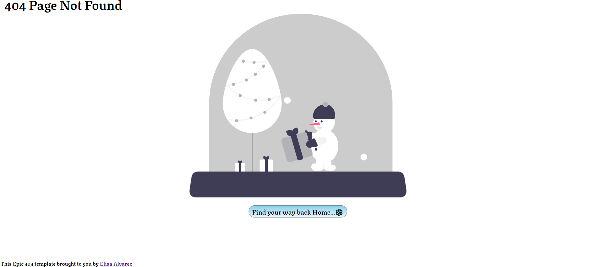

<!-- Please update value in the {}  -->

<h1 align="center">{404 Lost In The Snow}</h1>

   Solution for a challenge from  <a href="http://devchallenges.io" target="_blank">Devchallenges.io</a>.

  <h3>
    <a href="https://404-page-template.vercel.app/">
      Demo
    </a>
     | 
    <a href="https://github.com/Elisa-Alvarez/404-page-template/blob/master/404/src/404_Page.vue">
      Solution
    </a>
     | 
    <a href="https://devchallenges.io/challenges/wBunSb7FPrIepJZAg0sY">
      Challenge
    </a>
  </h3>

<!-- TABLE OF CONTENTS -->

## Table of Contents

- [Overview](#overview)
  - [Built With](#built-with)
- [Features](#features)
- [Contact](#contact)
- [Acknowledgements](#acknowledgements)

<!-- OVERVIEW -->

## Overview

This is my snowy 404 page template. A few thing about my project:

- You can find live project [here](https://404-page-template.vercel.app/)
- My experience with this project I learned how to make svg responsive as well as how to use CSS animations as well as how to apply them to a svg image.
- As an improvement I would animate the snowman to wave when you enter the page and have the lights on the christmas tree change different christmas colors.
- Figma was an intrical part to add and manipulate the svg and be able to change small parts of the image quickly.

### Built With

<!-- This section should list any major frameworks that you built your project using. Here are a few examples.-->

- [Vue.js](https://vuejs.org/)
- [CSS AnimationsS](https://www.w3schools.com/css/css3_animations.asp/)
- [Figma.com](figma.com)

## Features

<!-- List the features of your application or follow the template. Don't share the figma file here :) -->

This application/site was created as a submission to a [DevChallenges](https://devchallenges.io/challenges) challenge. The [challenge](https://devchallenges.io/challenges/wBunSb7FPrIepJZAg0sY) was to build an application to complete the given user stories.

## Acknowledgements

<!-- This section should list any articles or add-ons/plugins that helps you to complete the project. This is optional but it will help you in the future. For exmpale -->

- [Making SVGs Fluid Using CSS](https://tympanus.net/codrops/2014/08/19/making-svgs-responsive-with-css/#:~:text=In%20order%20to%20make%20an,leave%20the%20viewBox%20attribute%20present.)
- [Learn To Build An SVG Animation With CSS -YouTube](https://www.youtube.com/watch?v=gWai7fYp9PY)

## Contact

- Website [https://elisa-alvarez-dev-portfolio.vercel.app/](https://{elisa-alvarez-dev-portfolio.vercel.app/})
- GitHub [@Elisa-Alvarez](https://{github.com/Elisa-Alvarez})
- Twitter [@DeveloperElisa](https://{twitter.com/DeveloperElisa})
